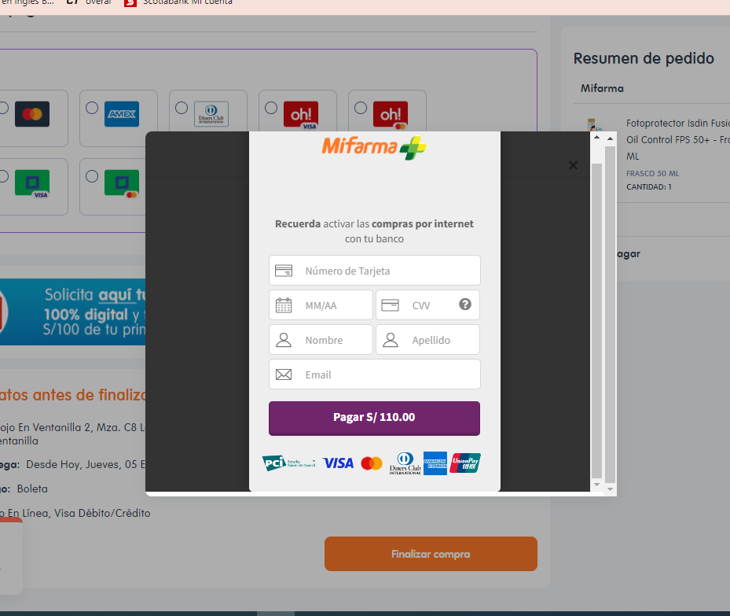
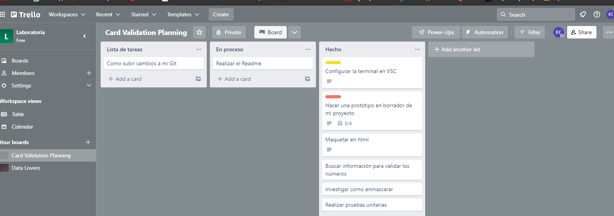

# Tarjeta de crédito válida

## Índice

* [1. Principales usuarios](#1-principales-usuarios)
* [2. Objetivos](#2-objetivos)
* [3. Proceso de trabajo](#3-proceso-de-trabajo)
***

## 1. Principales usuarios

Este proyecto fue desarrollado pensando en un público que consume productos de 
skin care. En esta interfaz los usuarios pueden validar el número de la tarjeta 
ingresada para continuar con el proceso de compra en línea de los productos. 

## 2. Objetivos

El objetivo principal es que la interfaz permita ingresar el número de una tarjeta
para que esta pueda ser validada y así mismo enmascarada, con el fin de realizar 
la compra, en el caso de que sea válida, caso contrario indicar que hubo un error.

## 3. Proceso de trabajo

* Comencé eligiendo el tema del proyecto que iba a realizar, posterior a ello busqué
algunas pasarelas de pago en diferentes páginas, que me sirvieran como ejemplo, al 
final me decidí por una que vi en la página de una farmacia.

* En base a este ejemplo, tomé los apartados que tenía y decidí que el cuadro de pago
se iba ubicar en el centro de la página, entre otras.
* Realicé un prototipo en borrador, de como iba a ser la estructura visual de mi interfaz,
para tenerlo mucho más claro
* En el transcurso de esa semana organicé mi horario, hice un planning en Trello, para 
hacerme la idea de por dónde iba a empezar.

* Así, poco a poco fui avanzando, debo admitir que hubiese querido darle mayor 
funcionalidad y es algo en lo que iré trabajando.
